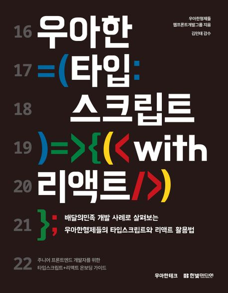
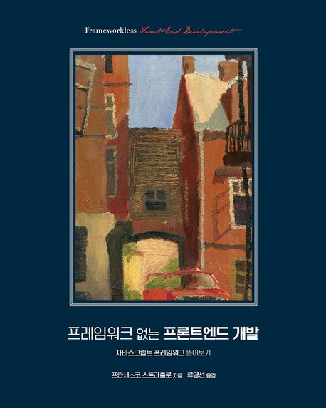

# bookshelf

독서를 기록하는 저장소 📚

 

<table>
  <tbody>
    <tr>
      <td align="center">
        
      </td>
      <td align="center">
        
      </td>
    </tr>
    <tr>
      <td>
        우아한 타입스크립트 with 리액트
      </td>
      <td>
        프레임워크 없는 프론트엔드 개발
      </td>
    </tr>
    <tr>
      <td align="center">
        <progress value="1" max="13"/>
      </td>
      <td align="center">
        <progress value="3" max="8"/>
      </td>
    </tr>
  </tbody>

</table>

 
