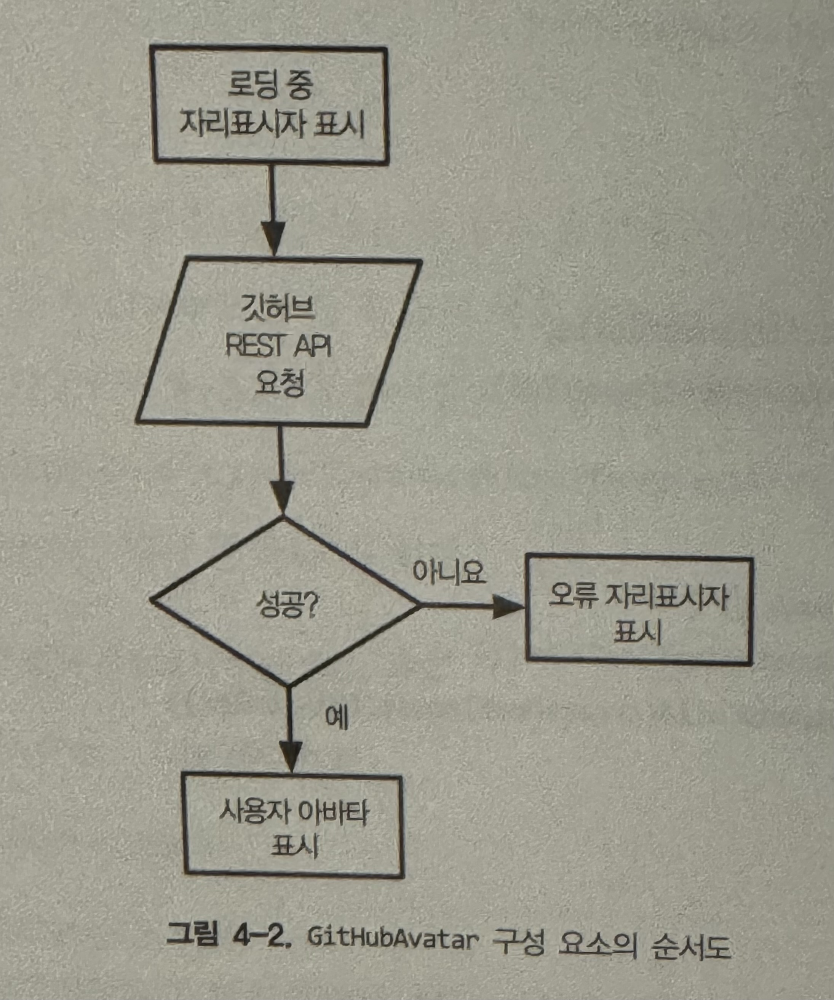

## 웹 구성 요소(컴포넌트)

웹 컴포넌트는 세 가지 중요 기술로 구성된다.

- **HTML 템플릿**: <template> 태그는 콘텐츠가 렌더링되지는 않지만 자바스크립트 코드에서 동적인 콘텐츠를 생성하는 데 사용될 수 있다.
- **사용자 정의 요소**: 이 API를 통해 완전한 커스텀 DOM 요소를 작성할 수 있다.
- **[섀도우 DOM](https://developer.mozilla.org/ko/docs/Web/API/Web_components/Using_shadow_DOM)**: 컴포넌트가 외부의 DOM에 영향을 받지 않아야 하는 경우에 사용한다. 컴포넌트 라이브러리나 위젯을 작성하려는 경우 유용하게 사용할 수 있다.

> #### ⚠️ 주의
>
> 섀도우 DOM과 가상 DOM은 완전히 다른 두 문제를 해결한다. 섀도우 DOM은 캡슐화와 관련되어 있고, 가상 DOM은 성능과 관련된다.

<br/>

### 사용자 정의 요소

사용자 정의 요소 API를 사용할 땐 대시로 구분된 두 단어 이상의 이름을 사용해야 한다. 사용자 정의 요소는 아래와 같이 선언할 수 있다.

```js
export default class HelloWorld extends HTMLElement {
  // 사용자 정의 요소의 라이프사이클 메서드 중 하나. 컴포넌트가 DOM에 연결될 때 호출된다.
  // 리액트의 componentDidMount 메서드와 유사하다.
  connectedCallback() {
    window.requestAnimationFrame(() => {
      const div = document.createElement('div');
      div.textContent = 'Hello World!';
      div.style.color = this.color;

      this.appendChild(div);
    });
  }
}
```

위에서 보는 바와 같이 **사용자 정의 요소는 HTML 요소를 확장하는 자바스크립트 클래스일 뿐이다**.

또한 이런 사용자 정의 요소를 사용하기 위해서는 브라우저 컴포넌트 레지스트리에 추가하여 태그 이름을 사용자 정의 요소 클래스와 연결해야 한다.

```js
import HellowWorld from './components/HelloWorld.js';

window.customElements.define('hello-world', HelloWorld);
```

<br/>

### 속성 관리

웹 컴포넌트의 핵심은 어떤 프레임워크와도 호환될 수 있어야 한다는 것이다. 이 목적을 달성하려면 표준 HTML 요소와 동일한 API를 사용해야 한다. 예를 들어, 사용자 정의 요소에 추가한 속성은 다른 속성과 동일한 방식으로 관리할 수 있어야 한다.

#### 표준 HTML 요소의 속성 관리

표준 요소는 세 가지 방법으로 속성을 설정할 수 있다.

```js
// HTML 마크업에서 직접 조작하기
<input type="text" value="Frameworkless" />;

// 자바스크립트에서 setter를 사용해 조작하기
input.value = 'Frameworkless';

// setAttribute 메서드를 사용해 조작하기
input.setAttribute('value', 'Frameworkless');
```

이렇게 추가된 속성은 getter, getAttribute 메서드로 값을 읽어들일 수 있다.

#### 사용자 정의 요소의 속성 관리

사용자 정의 요소 또한 표준 HTML 요소와 동일하게 작동해야 한다. 이는 게터와 세터를 정의하는 것으로 구현할 수 있다.

```js
const DEFAULT_COLOR = 'black';

export default class HelloWorld extends HTMLElement {
  get color() {
    return this.getAttribute('color') || DEFAULT_COLOR;
  }

  set color(value) {
    this.setAttribute('color', value);
  }

  connectedCallback() {
    window.requestAnimationFrame(() => {
      const div = document.createElement('div');
      div.textContent = 'Hello World!';
      div.style.color = this.color;

      this.appendChild(div);
    });
  }
}
```

```html
<hello-world></hello-world>
<hello-world color="red"></hello-world>
<hello-world color="green"></hello-world>
```

<br/>

### attributeChangedCallback

위의 예제에서 connectedCallback 메서드 안에서 color 속성을 초기화하고 DOM에 적용했다. 여기서 클릭 이벤트 핸들러를 붙여 핸들러 안에서 color 속성을 변경하도록 하면 어떤 일이 일어날까?

버튼을 클릭하면 핸들러는 모든 HelloWorld 구성 요소의 color 속성의 값을 변경하지만, 화면에는 아무 일도 일어나지 않는다. 실제로 DOM이 업데이트된 것은 아니기 때문이다. 문제를 해결하기 위한 바람직한 방법은 라이프사이클을 이용하는 방법이다.

`attributeChangedCallback` 메서드는 속성이 변경될 때마다 호출되는 메서드다. 즉, 이 메서드를 사용하면 새로운 color 속성이 제공될 때마다 DOM이 업데이트되도록 할 수 있다.

```js
const DEFAULT_COLOR = 'black';

export default class HelloWorld extends HTMLElement {
  // observedAttributes에 나열된 속성만 attributeChangedCallback이 트리거 된다.
  static get observedAttributes() {
    return ['color'];
  }

  get color() {
    return this.getAttribute('color') || DEFAULT_COLOR;
  }

  set color(value) {
    this.setAttribute('color', value);
  }

  // 속성이 변경되면 실행되는 콜백 함수를 정의한다.
  attributeChangedCallback(name, oldValue, newValue) {
    if (!this.div) return;

    if (name === 'color' && oldValue !== newValue) {
      this.div.style.color = newValue;
    }
  }

  connectedCallback() {
    window.requestAnimationFrame(() => {
      const div = document.createElement('div');
      div.textContent = 'Hello World!';
      div.style.color = this.color;

      this.appendChild(div);
    });
  }
}
```

<br/>

### 사용자 정의 이벤트

GithubAvatar 컴포넌트로 좀 더 복잡한 로직을 살펴 본다. 해당 구성 요소의 순서도는 아래와 같다.



해당 순서도의 핵심은 아바타 이미지를 가져오는 로직이다. 통신에 성공하면 아바타를 표시하고, 그렇지 않으면 오류 placeholder를 표시해야 한다.

이와 같이 컴포넌트 외부의 HTTP 요청 결과에 반응하려면 어떻게 해야 할까? **표준 HTTP 동작과 동일하게 맞추기 위해 아바타가 로드됐을 때와 오류가 발생했을 때의 두 가지 이벤트에 대응한다**.

```js
const AVATAR_LOAD_COMPLETE = 'AVATAR_LOAD_COMPLETE';
const AVATAR_LOAD_ERROR = 'AVATAR_LOAD_ERROR';

export const EVENTS = {
  AVATAR_LOAD_COMPLETE,
  AVATAR_LOAD_ERROR,
};

export default class GitHubAvatar extends HTMLElement {
  ...
  onLoadAvatarComplete() {
    const event = new CustomEvent(AVATAR_LOAD_COMPLETE, {
      detail: {
        avatar: this.url
      }
    })
    this.dispatchEvent(event)
  }

  onLoadAvatarError (error) {
    const event = new CustomEvent(AVATAR_LOAD_ERROR, {
      detail: {
        error
      }
    })
    this.dispatchEvent(event)
  }

  async loadNewAvatar() {
    const {user } = this
    if(!user) {
      return
    }

    try {
      this.url = await getGitHubAvatarUrl(user)
      this.onLoadAvatarComplete()
    } catch(e) {
      this.url = ERROR_IMAGE
      this.onLoadAvatarError(e)
    }

    this.render()
  }
}
```

이제 두 종류의 이벤트에 이벤트 핸들러를 연결한다.

```js
import { EVENTS } from './components/GitHubAvatar.js';

document.querySelectorAll('github-avatar').forEach((avatar) => {
  avatar.addEventListener(EVENTS.AVATAR_LOAD_COMPLETE, (e) => {
    console.log('Avatar Loaded', e.detail.avatar);
  });

  avatar.addEventListener(EVENTS.AVATAR_LOAD_ERROR, (e) => {
    console.log('Avatar Loading error', e.detail.error);
  });
});
```
